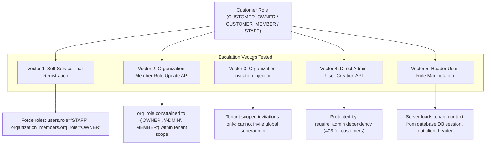

# Phase 12.1 — Role Boundary & Privilege Escalation Verification

**Objective**: Verify that customer roles (`CUSTOMER_OWNER`, `CUSTOMER_MEMBER`, and customer-side `STAFF`) cannot escalate privileges to internal operator roles (`ADMIN`, `SUPER_ADMIN`, `SYSTEM_OWNER`, or internal `STAFF`).

---

## 1. Attack Vectors Tested & Verified

---

## 2. Detailed Role Escalation Prevention Audit

### 1. Self-Service Registration (`/api/auth/register-trial`)
- **Assertion**: When a prospective customer signs up via the landing page trial registration, their account is provisioned with `users.role = 'STAFF'` and `organization_members.org_role = 'OWNER'`.
- **Enforcement**: Server-side registration logic in `register_trial_tenant_db()` hardcodes the user role to standard tenant customer. No client-supplied parameter can override the global role to `ADMIN` or `SUPER_ADMIN`.

### 2. Organization Member Role Updates (`PUT /api/saas/organization/members/{target_user_id}/role`)
- **Assertion**: Organization owners can only assign tenant-scoped roles (`MEMBER`, `ADMIN`, `OWNER`) within their own `org_id`.
- **Enforcement**: Multi-tenant database constraint `CHECK (org_role IN ('OWNER', 'ADMIN', 'MEMBER'))` restricts organizational scope. This does not grant global system administration privileges.

### 3. Direct Admin APIs (`/api/admin/users`, `/api/owner/*`, `/api/superadmin/*`)
- **Assertion**: Customer sessions attempting to invoke internal operator endpoints receive HTTP `403 Forbidden`.
- **Enforcement**: FastApi dependency injection (`Depends(require_admin)`, `Depends(require_operator_or_admin)`) validates the database-stored global role against the authorized operator list (`["SUPER_ADMIN", "ADMIN", "OWNER"]`).

---

## 3. Role Boundary Verdict

**All role boundaries are strictly enforced server-side.** Privilege escalation from customer roles to internal platform operators is impossible.
