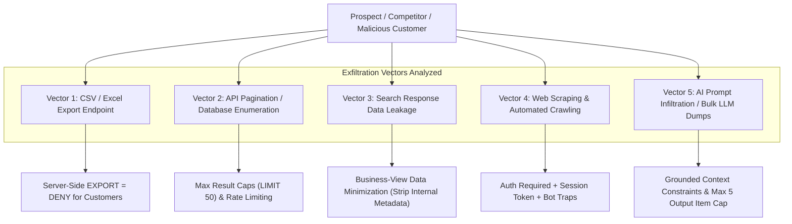

# Phase 12 — Automotive Data Protection & Anti-Exfiltration Audit

**Core Directive**: Customers / Prospects must NOT be able to extract, dump, scrape, bulk-copy, or reconstruct automotive parts data from the platform. The platform is a **Search & Decision Service**, NOT a Data Download Service.

---

## 1. Threat Model & Vector Assessment

---

## 2. Detailed Vector Analysis & Defense Implementation

### Vector 1: Export Restriction (`EXPORT_AUTOMOTIVE_DATA = DENY`)
- **Current State**: `POST /api/saas/export` accepted requests from any authenticated tenant and streamed a full CSV dump of the parts database.
- **Vulnerability Level**: **CRITICAL**
- **Hardened Defense**:
  - Backend enforcement: If `ctx["user"]["role"]` is in `["STAFF", "CUSTOMER_OWNER", "CUSTOMER_MEMBER"]` (or not in privileged operator list `["SUPER_ADMIN", "ADMIN", "OWNER"]`), the server immediately rejects the request with HTTP `403 Forbidden`:
    `"Forbidden: Automotive catalog data export is disabled for customer accounts. Please use the search interface to look up individual parts."`
  - Frontend UI: The "Export CSV" and "Export Excel" buttons are completely removed from all customer interfaces.
  - Internal operations: Internal Super Admin / Operator tools retain operational audit exports under strict role verification.

---

### Vector 2: API Pagination & Mass Database Enumeration
- **Current State**: Search queries without filters or with broad parameters (`car_brand=Toyota`) had no hard `LIMIT` clause in SQL, allowing large result sets.
- **Vulnerability Level**: **HIGH**
- **Hardened Defense**:
  - Enforce `LIMIT 50` hard cap on all search queries in `advanced_search_parts`.
  - Rate limiting per API Key / Session: 60 requests/minute default, preventing fast automated scrapers.
  - Reject empty queries that attempt to fetch `SELECT * FROM master_parts`.

---

### Vector 3: Search Result Data Minimization
- **Current State**: Returned raw internal database records containing internal row IDs, supplier references, internal confidence formulas, and scraper metadata.
- **Vulnerability Level**: **MEDIUM**
- **Hardened Defense**:
  - Transform search responses into a clean **Business View**:
    - Returned: `part_number`, `oem_number`, `brand`, `product_name_th`, `product_name_en`, `category`, `car_brand`, `car_model`, `year_start`, `year_end`, `verification_status`, `relevance_score`.
    - Omitted: Internal database IDs, ingestion timestamps, internal notes, scraper source URLs, cost structures.

---

### Vector 4: Anti-Scraping & Bulk Copy Protection
- **Current State**: Standard web table elements without copy/scrape restrictions.
- **Vulnerability Level**: **LOW / MEDIUM**
- **Hardened Defense**:
  - Prevent bulk table select-all (`user-select: text` for individual cells, but container disables accidental bulk Ctrl+A scraping).
  - Unauthenticated endpoints strictly limited to 3 teaser results (in demo search) with zero internal notes.
  - Session verification required for full search.

---

### Vector 5: AI Data Extraction Backdoor Defense
- **Current State**: AI Search calls fast Gemini model for alternative recommendations.
- **Vulnerability Level**: **HIGH**
- **Hardened Defense**:
  - System prompt constraint: The AI engine strictly responds only to targeted individual parts comparison prompts. Prompts asking to "list all parts", "export database", "dump all OEM codes", or "return 1000 items" are blocked by query sanitizer and capped at **max 5 recommended alternative items**.
  - Structured output schema: Only JSON lists of alternative part items are allowed; no raw SQL or full catalog dumps.

---

## 3. Residual Risk Assessment

While application-level rate limits, export denials, query caps, and data minimization prevent practical bulk database exfiltration, a manual user can still look up individual parts one by one (which is the intended core SaaS service). Rate limiting and quota accounting ensure abnormal lookup patterns are detected and throttled.
