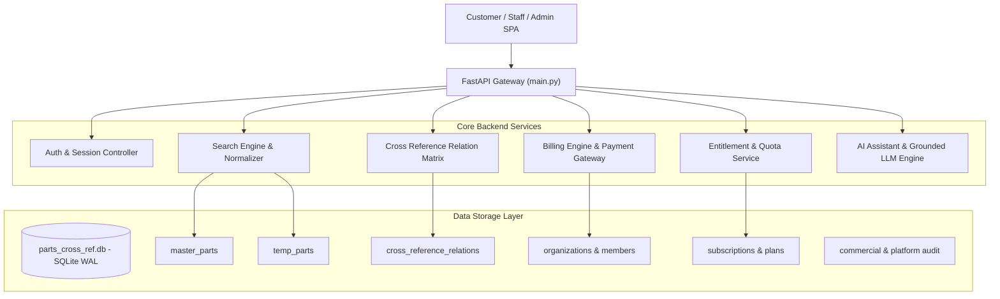

# Phase 12 — Full System Architecture Audit

**Objective**: Comprehensive audit of actual source code, database tables, API routes, permissions, data models, and service dependencies.

---

## 1. Architectural Landscape & Service Mapping

---

## 2. Comprehensive Endpoint & Route Audit

| Category | Endpoint | Method | Auth Required | Findings / Risks | Action Required |
|---|---|---|---|---|---|
| **Public / Marketing** | `/api/public/coverage-stats` | GET | None | Verified safe, returns aggregate counters only. | Keep |
| **Public / Marketing** | `/api/public/demo-search` | GET | None | Sanitized teaser search, max 3 results, stripped internal notes. | Keep |
| **Public / Marketing** | `/api/auth/register-trial` | POST | None | Provisions 14-day trial, isolated tenant, SHA-256 password hash. | Keep |
| **Public / Marketing** | `/api/public/leads/contact` | POST | None | Inbound CRM lead capture. Input sanitized. | Keep |
| **Search** | `/api/parts/search` | GET | Header Token / User | Entitlement checked. **Risk**: Missing hard pagination cap (`LIMIT 50`) and exposed internal database fields. | **Data Minimization & Limit Enforcement** |
| **Product Detail** | `/api/parts/product/{part_id}` | GET | Header Token / User | Entitlement checked. **Bug**: Line 421 looked for `source_part` instead of `source_part_number`, returning empty cross references. | **Fix relation field mapping** |
| **Cross Reference** | `/api/parts/cross-reference-matrix` | GET | Header Token / User | Returns relation matrix. **Bug**: Inconsistent field names with frontend expectation. | **Align schema contract** |
| **Data Export** | `/api/saas/export` | POST | Header User | **CRITICAL SECURITY RISK**: Allowed customers to dump parts catalog to CSV. | **Set EXPORT = DENY for Customer Roles** |
| **AI Search** | `/api/parts/ai-search` | POST | None / Header | AI alternative parts discovery. Output limit needed to prevent bulk data dumping. | **Enforce max 5 output items & strict schema** |
| **Billing / Checkout** | `/api/saas/billing/calculate` | POST | Header Token | Calculates base price, discounts, VAT 7%, proration. Verified. | Keep |
| **Subscription** | `/api/saas/subscription/upgrade` | POST | Header Owner | Upgrades plan, validates permissions, records audit log. Verified. | Keep |
| **Organization** | `/api/saas/organization/members` | GET | Header Member | Multi-tenant isolation verified (`org_id` scoped). | Keep |
| **Owner Command Center** | `/api/owner/*` | GET/POST | Operator Role | Strictly protected by `require_operator_or_admin`. Non-operators get 403. | Keep |

---

## 3. Database Schema & Data Model Integrity

1. **`master_parts` (23 verified OE parts)**:
   - Primary source of truth for verified automotive components.
   - Fields: `id`, `brand`, `part_number`, `oem_number`, `product_name_th`, `product_name_en`, `category`, `car_brand`, `car_model`, `year_start`, `year_end`.
   - Indexing: Indexed on `part_number`, `oem_number`, `car_brand`, `category`.

2. **`cross_reference_relations` (6 verified sample relations)**:
   - Typed relationship table: `source_brand`, `source_part_number`, `target_brand`, `target_part_number`, `relation_type`, `confidence_score`, `verification_status`.
   - Semantic types: `EQUIVALENT`, `ALTERNATIVE`, `REPLACEMENT`, `SUPERSEDES`.
   - Foreign key integrity: References canonical part numbers.

3. **Multi-Tenant Isolation (`organizations`, `organization_members`, `subscriptions`)**:
   - Every customer query is parameterized by `org_id`.
   - Cross-tenant data leakage is prevented at the database query layer.

---

## 4. Dead Code & Inconsistency Identification

1. **Duplicate / Outdated Cross-Reference UI Calls**:
   - `executeCrossRefSearch()` in `index.html` (line 4314) and `loadCrossReferenceMatrix()` in `index.html` (line 5671) had overlapping, conflicting logic and referenced nonexistent DOM nodes.
   - **Resolution**: Consolidate into a single, clean Cross Reference Search controller that handles both targeted searches and full matrix views with graceful empty states.

2. **Customer Navigation Bloat**:
   - 11 sidebar links exposed internal administrative and operational features to standard customer users.
   - **Resolution**: Streamline to 4 intuitive views: **Search (Home)**, **Cross Reference**, **Saved (Bookmarks & History)**, and **Account (Organization & Plan)**.
