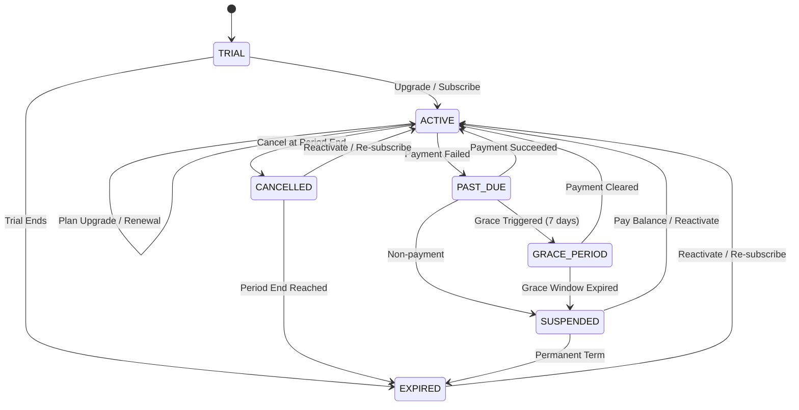

# Phase 5: Subscription Lifecycle & State Machine Specification

## 1. Subscription States

| State | Search Access | API Access | Billing Allowed | Description |
| :--- | :---: | :---: | :---: | :--- |
| **`TRIAL` / `TRIALING`** | ✅ Yes | Limited | ✅ Yes | Free trial period. Upgrades transition instantly to `ACTIVE`. |
| **`ACTIVE`** | ✅ Yes | ✅ Yes | ✅ Yes | Normal subscription in good standing. Quota and limits enforced. |
| **`PAST_DUE`** | ⚠️ Warning | ⚠️ Warning | ✅ Yes | Payment failed on renewal. Automatic retries scheduled. |
| **`GRACE_PERIOD`** | ✅ Yes | ⚠️ Restricted | ✅ Yes | 7-day grace period with warning banner. Read-only parts search allowed. |
| **`SUSPENDED`** | ❌ Blocked | ❌ Blocked | ✅ Yes | Access locked due to unresolved payment. Customer data preserved. |
| **`CANCELLED`** | ✅ Active until End | ✅ Active until End | ❌ No Renew | Cancelled at period end (`cancel_at_period_end = 1`). Transitions to `EXPIRED` at end. |
| **`EXPIRED`** | ❌ Blocked | ❌ Blocked | ❌ No | Term ended without renewal. Customer can reactivate at any time. |

---

## 2. State Transition Matrix



---

## 3. Allowed Transitions in Code (`SubscriptionStateMachine`)

```python
ALLOWED_TRANSITIONS = {
    "TRIAL": ["ACTIVE", "EXPIRED", "SUSPENDED", "CANCELLED"],
    "TRIALING": ["ACTIVE", "EXPIRED", "SUSPENDED", "CANCELLED"],
    "ACTIVE": ["PAST_DUE", "GRACE_PERIOD", "CANCELLED", "ACTIVE"],
    "PAST_DUE": ["ACTIVE", "GRACE_PERIOD", "SUSPENDED", "EXPIRED"],
    "GRACE_PERIOD": ["ACTIVE", "SUSPENDED", "EXPIRED"],
    "SUSPENDED": ["ACTIVE", "EXPIRED"],
    "CANCELLED": ["ACTIVE", "EXPIRED"],
    "CANCELED": ["ACTIVE", "EXPIRED"],
    "EXPIRED": ["ACTIVE"]
}
```

---

## 4. Cancellation & Expiration Policy
1. **Cancel at End of Billing Period**:
   - `cancel_at_period_end` set to `1`.
   - `status` set to `CANCELLED`.
   - Customer continues to search parts and use features until `current_period_end`.
   - At period end, status changes to `EXPIRED`.
2. **Data Retention**:
   - Suspended or expired subscriptions do **NOT** delete tenant organizations, favorites, team accounts, or search logs.
   - Login, invoice retrieval, support contact, and one-click reactivation remain available.
